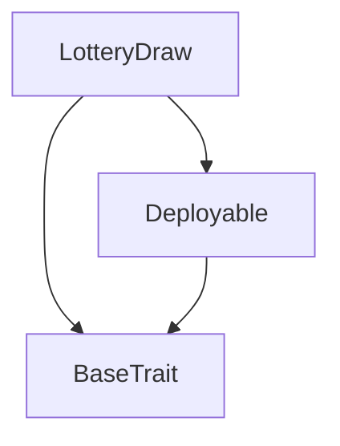
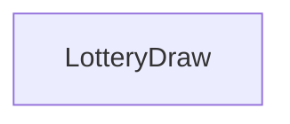

# Tact compilation report
Contract: LotteryDraw
BoC Size: 6376 bytes

## Structures (Structs and Messages)
Total structures: 25

### DataSize
TL-B: `_ cells:int257 bits:int257 refs:int257 = DataSize`
Signature: `DataSize{cells:int257,bits:int257,refs:int257}`

### SignedBundle
TL-B: `_ signature:fixed_bytes64 signedData:remainder<slice> = SignedBundle`
Signature: `SignedBundle{signature:fixed_bytes64,signedData:remainder<slice>}`

### StateInit
TL-B: `_ code:^cell data:^cell = StateInit`
Signature: `StateInit{code:^cell,data:^cell}`

### Context
TL-B: `_ bounceable:bool sender:address value:int257 raw:^slice = Context`
Signature: `Context{bounceable:bool,sender:address,value:int257,raw:^slice}`

### SendParameters
TL-B: `_ mode:int257 body:Maybe ^cell code:Maybe ^cell data:Maybe ^cell value:int257 to:address bounce:bool = SendParameters`
Signature: `SendParameters{mode:int257,body:Maybe ^cell,code:Maybe ^cell,data:Maybe ^cell,value:int257,to:address,bounce:bool}`

### MessageParameters
TL-B: `_ mode:int257 body:Maybe ^cell value:int257 to:address bounce:bool = MessageParameters`
Signature: `MessageParameters{mode:int257,body:Maybe ^cell,value:int257,to:address,bounce:bool}`

### DeployParameters
TL-B: `_ mode:int257 body:Maybe ^cell value:int257 bounce:bool init:StateInit{code:^cell,data:^cell} = DeployParameters`
Signature: `DeployParameters{mode:int257,body:Maybe ^cell,value:int257,bounce:bool,init:StateInit{code:^cell,data:^cell}}`

### StdAddress
TL-B: `_ workchain:int8 address:uint256 = StdAddress`
Signature: `StdAddress{workchain:int8,address:uint256}`

### VarAddress
TL-B: `_ workchain:int32 address:^slice = VarAddress`
Signature: `VarAddress{workchain:int32,address:^slice}`

### BasechainAddress
TL-B: `_ hash:Maybe int257 = BasechainAddress`
Signature: `BasechainAddress{hash:Maybe int257}`

### Deploy
TL-B: `deploy#946a98b6 queryId:uint64 = Deploy`
Signature: `Deploy{queryId:uint64}`

### DeployOk
TL-B: `deploy_ok#aff90f57 queryId:uint64 = DeployOk`
Signature: `DeployOk{queryId:uint64}`

### FactoryDeploy
TL-B: `factory_deploy#6d0ff13b queryId:uint64 cashback:address = FactoryDeploy`
Signature: `FactoryDeploy{queryId:uint64,cashback:address}`

### Ticket_Owner
TL-B: `_ participent:address reward:int257 hasClaimed:bool = Ticket_Owner`
Signature: `Ticket_Owner{participent:address,reward:int257,hasClaimed:bool}`

### Ticket
TL-B: `ticket#9832e795 ticketId:int257 = Ticket`
Signature: `Ticket{ticketId:int257}`

### Tickets
TL-B: `tickets#ccd5cd9f ticketIds:dict<int, int> ticketcount:int257 = Tickets`
Signature: `Tickets{ticketIds:dict<int, int>,ticketcount:int257}`

### TicketId
TL-B: `ticket_id#55fac4f8 ticket:int257 = TicketId`
Signature: `TicketId{ticket:int257}`

### DecreaseTime
TL-B: `decrease_time#bbd11a32 seconds:int257 = DecreaseTime`
Signature: `DecreaseTime{seconds:int257}`

### IncreaseTime
TL-B: `increase_time#ed0b1534 seconds:int257 = IncreaseTime`
Signature: `IncreaseTime{seconds:int257}`

### IncreaseTicket
TL-B: `increase_ticket#c346146e ticket:int257 = IncreaseTicket`
Signature: `IncreaseTicket{ticket:int257}`

### DecreaseTicket
TL-B: `decrease_ticket#e4e61ee9 ticket:int257 = DecreaseTicket`
Signature: `DecreaseTicket{ticket:int257}`

### Prepare_rewards
TL-B: `prepare_rewards#a1ed4eaa  = Prepare_rewards`
Signature: `Prepare_rewards{}`

### Distribute_rewards
TL-B: `distribute_rewards#a1ed4eab  = Distribute_rewards`
Signature: `Distribute_rewards{}`

### Ownership
TL-B: `ownership#a1ed4eac name:^string = Ownership`
Signature: `Ownership{name:^string}`

### LotteryDraw$Data
TL-B: `_ owner:address bid:int257 adminPercentage:int257 floorPercentage:int257 bonusPercentage:int257 decayFactorNumerator:int257 decayFactorDenominator:int257 fixedPointScale:int257 admin:address tickets:dict<int, int> participents:dict<int, ^Ticket_Owner{participent:address,reward:int257,hasClaimed:bool}> totalPool:int257 participantCount:int257 rewardsPrepared:bool rewardsDistributed:bool minPrize:int257 remainingPool:int257 bonusCount:int257 guaranteedWinPool:int257 decayWinnerSum:int257 remainingDecaySum:int257 startTime:int257 endTime:int257 maxTicket:int257 = LotteryDraw`
Signature: `LotteryDraw{owner:address,bid:int257,adminPercentage:int257,floorPercentage:int257,bonusPercentage:int257,decayFactorNumerator:int257,decayFactorDenominator:int257,fixedPointScale:int257,admin:address,tickets:dict<int, int>,participents:dict<int, ^Ticket_Owner{participent:address,reward:int257,hasClaimed:bool}>,totalPool:int257,participantCount:int257,rewardsPrepared:bool,rewardsDistributed:bool,minPrize:int257,remainingPool:int257,bonusCount:int257,guaranteedWinPool:int257,decayWinnerSum:int257,remainingDecaySum:int257,startTime:int257,endTime:int257,maxTicket:int257}`

## Get methods
Total get methods: 11

## random_uint
Argument: max
Argument: salt

## get_decay_weight
Argument: index

## get_participant_count
No arguments

## get_total_Pool
No arguments

## get_Ticket_Data
Argument: tk

## get_Ticket_TotalData
No arguments

## get_Ticket_map
No arguments

## get_BonusCount
No arguments

## get_prize
Argument: index

## get_MinPrize
No arguments

## get_Bid
No arguments

## Exit codes
* 2: Stack underflow
* 3: Stack overflow
* 4: Integer overflow
* 5: Integer out of expected range
* 6: Invalid opcode
* 7: Type check error
* 8: Cell overflow
* 9: Cell underflow
* 10: Dictionary error
* 11: 'Unknown' error
* 12: Fatal error
* 13: Out of gas error
* 14: Virtualization error
* 32: Action list is invalid
* 33: Action list is too long
* 34: Action is invalid or not supported
* 35: Invalid source address in outbound message
* 36: Invalid destination address in outbound message
* 37: Not enough Toncoin
* 38: Not enough extra currencies
* 39: Outbound message does not fit into a cell after rewriting
* 40: Cannot process a message
* 41: Library reference is null
* 42: Library change action error
* 43: Exceeded maximum number of cells in the library or the maximum depth of the Merkle tree
* 50: Account state size exceeded limits
* 128: Null reference exception
* 129: Invalid serialization prefix
* 130: Invalid incoming message
* 131: Constraints error
* 132: Access denied
* 133: Contract stopped
* 134: Invalid argument
* 135: Code of a contract was not found
* 136: Invalid standard address
* 138: Not a basechain address
* 6531: Only admin can increase ticket count
* 9971: Sorry!This Ticket has not participated in draw!
* 10738: Reward Not Distributed Yet. wait for draw!!
* 10839: first prepared reward then distribute reward
* 15882: Only admin can increase time
* 16461: Only admin
* 19684: Cannot decrease ticket count below zero
* 22830: Duplicate ticket not allowed
* 24322: You have already claimed your reward!
* 25826: Only current owner can transfer ownership
* 26163: Only admin can decrease time
* 26571: Cannot decrease time beyond start time
* 36968: Amount is not enough for buying....
* 37181: Rewards already prepared
* 39078: No participants
* 42805: Sorry! We have finished selling tickets...
* 48696: No tickets provided
* 48981: Only admin can decrease ticket count
* 49271: Invalid ticket ID
* 49658: Already prepared
* 56656: Reward Already Distributed
* 59515: you have not participated in draw!!
* 63603: Sorry! we have ran out of tickets..

## Trait inheritance diagram

## Contract dependency diagram

